# Draft Database Integration Design

This document describes how a Discord-based Memory Collector bot should integrate with the Descriptor Form Database and Living Identity Graph while keeping the database as the source of truth.

## Direction

The Descriptor Form Database becomes backend infrastructure. The bot is an alternative intake interface for people who would rather talk in Discord than complete the static form.

The bot must generate draft profile updates and change requests. It must not directly mutate approved canonical profiles.

## Target Runtime

- nanobot host
- Python implementation
- OpenClaw-style bot architecture
- Discord slash commands
- local or service-backed draft queue
- review-dashboard-compatible JSON exports

## Architecture Overview

```mermaid
flowchart LR
  Discord["Discord user"] --> Bot["Memory Collector bot"]
  Bot --> Interview["Conversational interview state"]
  Interview --> Classifier["Epistemic classifier"]
  Classifier --> Drafts["Draft change requests"]
  Drafts --> Queue["Draft intake queue"]
  Queue --> Export["Review JSON export"]
  Export --> Review["review.html"]
  Review --> Canon["Approved profile JSON archive"]
  Canon --> Graph["Living Identity Graph exports"]
```



## Boundary

The bot may:

- read public schema/docs and controlled vocabularies
- load an approved profile snapshot for context, if available
- draft `governance.change_requests`
- draft `governance.claim_requests`
- draft `governance.relationship_approvals`
- draft unresolved source questions
- export review packets

The bot must not:

- write directly to canonical profile fields
- mark a change as `approved` or `applied`
- promote `factual`, `biography`, `Canon`, or `exportable`
- bypass relationship approval
- publish raw private submissions
- store source images or private files in the public repo

## Modules

### Discord Adapter

Responsibilities:

- register slash commands
- manage message/thread routing
- resolve Discord user ID/display name
- handle ephemeral vs channel-visible responses
- send draft summaries and confirmation prompts

Recommended commands:

- `/about`
- `/profile`
- `/memory`
- `/lore`
- `/correct`
- `/relationship`

### Conversation State

Responsibilities:

- keep short-lived interview sessions
- track subject, context, unresolved questions, and draft items
- support threaded follow-up
- expire abandoned sessions

Suggested state fields:

```json
{
  "session_id": "discord_thread_or_interaction_id",
  "started_at": "ISO-8601",
  "updated_at": "ISO-8601",
  "discord_user_id": "",
  "discord_display_name": "",
  "subject_ref": "",
  "context_id": "other",
  "mode": "memory | profile | lore | correct | relationship",
  "collected_facts": [],
  "unresolved_questions": [],
  "draft_changes": []
}
```

### Epistemic Classifier

Responsibilities:

- classify `context_id`
- classify `information_type`
- classify `reality_status`
- classify `perspective`
- choose conservative `visibility`
- detect when more clarification is required

Known `context_id` values should match the review dashboard registry:

- `global`
- `en`
- `htf`
- `oregon_fail`
- `shawniverse`
- `sketchpad_survivors`
- `little_dust_devil`
- `hi_orbit_games`
- `k_st_engineering`
- `future_projects`
- `other`

### Draft Builder

Responsibilities:

- generate stable-ish IDs
- choose review-dashboard-compatible target paths
- build structured `payload` objects
- mirror metadata onto both the change request and payload
- set status to `reviewer_pending`, `needs_owner_review`, or `needs_bilateral_approval`

ID pattern:

```text
chg_{kind}_{YYYYMMDD}_{short_slug}
story_{short_slug}
event_{short_slug}
rel_{person_a}_{person_b}_{short_slug}
```

### Draft Queue

Responsibilities:

- store bot-generated drafts before human review
- support export by profile, subject, context, date, or submitter
- avoid mixing raw private Discord content with public repo exports

Possible implementations:

- local JSONL files in a private deployment volume
- SQLite table in the bot service
- private cloud drive export folder
- future backend endpoint once the static workflow outgrows file review

Do not commit real draft queues to this public repository.

## Review-Compatible Change Request Contract

Use the existing schema `governance.change_requests[]` shape:

```json
{
  "change_id": "chg_memory_20260606_example",
  "type": "add_story",
  "operation": "append",
  "target_path": "narrative_engine.story_provenance",
  "proposed_by": "discord:123456789",
  "status": "reviewer_pending",
  "submitted_at": "2026-06-06T00:00:00.000Z",
  "summary": "Add example lore from Discord interview.",
  "visibility": "reviewer_only",
  "payload_notes": "Drafted by Memory Collector. Human review required.",
  "payload": {
    "story_id_title": "story_example",
    "summary": "Public-safe summary.",
    "who_told_it": "discord:123456789",
    "source_type": "self_report",
    "confidence_canon": "Raw",
    "witnesses": [],
    "related_people": [],
    "notes": "Reviewer should verify before applying.",
    "context_id": "other",
    "information_type": "lore",
    "reality_status": "unknown",
    "perspective": "self_report"
  },
  "context_id": "other",
  "information_type": "lore",
  "reality_status": "unknown",
  "perspective": "self_report"
}
```

## Applicable Target Paths

The current review dashboard can apply changes to these paths:

- `narrative_engine.story_provenance`
- `knowledge_graph.events`
- `knowledge_graph.relationship_entities`
- `knowledge_graph.timeline`
- `knowledge_graph.links`
- `relationship_graph`
- `asset_library.assets`
- `knowledge_graph.projects`
- `project_usage.approved_projects`
- `project_usage.project_specific_notes`
- `source_notes.unresolved_questions`

The bot should prefer these paths so drafts can move through review without custom tooling.

## Relationship Handling

Relationship material involving real people defaults to restricted review:

```json
{
  "type": "add_relationship",
  "operation": "append",
  "target_path": "knowledge_graph.relationship_entities",
  "status": "needs_bilateral_approval",
  "visibility": "reviewer_only",
  "payload": {
    "relationship_id": "rel_example",
    "person_a": "person_a_or_name",
    "person_b": "person_b_or_name",
    "relationship_type": "friend",
    "requested_visibility": "reviewer_only",
    "person_a_approval": "unknown",
    "person_b_approval": "unknown",
    "reviewer_status": "pending",
    "context_id": "other",
    "information_type": "relationship",
    "reality_status": "subjective",
    "perspective": "third_party"
  }
}
```

Also draft a matching `governance.relationship_approvals[]` row when export visibility could ever become `project_only` or `exportable`.

## Command Flows

### `/memory`

1. User shares a memory.
2. Bot asks classification/source/context if needed.
3. Bot drafts `add_story`, `add_event`, `timeline`, or `source_notes.unresolved_questions`.
4. Bot shows a concise summary and says it is pending review.

### `/lore`

1. User shares group/project lore or inside joke.
2. Bot defaults to `information_type: lore` or `joke_meme`.
3. Bot defaults to `reality_status: lore`, `fictional`, `parody`, or `unknown`.
4. Bot drafts story/concept/project notes.

### `/profile`

1. Bot starts a natural interview.
2. Bot collects identity, vibe, consent, stories, and context.
3. Bot emits either a profile draft packet or change requests against an existing profile.

### `/correct`

1. User identifies a wrong, too-public, or misclassified item.
2. Bot drafts a correction or unresolved source question.
3. Promotions to factual/biography/canon are marked `reclassification_review_required`.

### `/relationship`

1. Bot captures the relationship observation.
2. Bot asks who is involved, source, context, and privacy.
3. Bot defaults to `reviewer_only` and `needs_bilateral_approval` where appropriate.

## Export Packet

The bot should export batches in this shape:

```json
{
  "packet_schema": "memory_collector.review_packet.v1",
  "generated_at": "ISO-8601",
  "source_system": "Discord Memory Collector",
  "target_schema_id": "kstreet_person_profile.v3",
  "target_schema_version": "3.0.0",
  "drafts": [
    {
      "profile_id": "optional-known-profile-id",
      "subject_display_name": "Name or alias",
      "governance": {
        "claim_requests": [],
        "change_requests": [],
        "relationship_approvals": []
      },
      "source_notes": {
        "unresolved_questions": []
      }
    }
  ]
}
```

## OpenClaw-Style Service Layout

Suggested Python package layout:

```text
memory_collector_bot/
  app.py
  config.py
  discord_adapter.py
  commands/
    about.py
    profile.py
    memory.py
    lore.py
    correct.py
    relationship.py
  core/
    classifier.py
    draft_builder.py
    conversation_state.py
    validators.py
  storage/
    draft_queue.py
    profile_snapshot_store.py
  exporters/
    review_packet.py
  tests/
```

## Validation Rules

Before enqueue/export:

- require `change_id`
- require `type`, `operation`, and `target_path`
- require `status` not in approved/applied states
- require `context_id`
- require `information_type`
- require `reality_status`
- require `perspective`
- require structured `payload` or `payload_json` for applyable changes
- reject default `factual` unless an explicit correction flow requests reviewer promotion
- reject default `exportable` for real-person or relationship data
- mark relationship drafts involving real people as needing approval

## Next Implementation Steps

1. Create the Python nanobot scaffold.
2. Implement context and classification constants from this repo.
3. Implement slash command handlers with conversation state.
4. Implement draft builder and validators.
5. Export review packets compatible with `review.html`.
6. Add fixture tests for memory, lore, correction, and relationship flows.
7. Add a private deployment storage plan for Discord draft queues.

